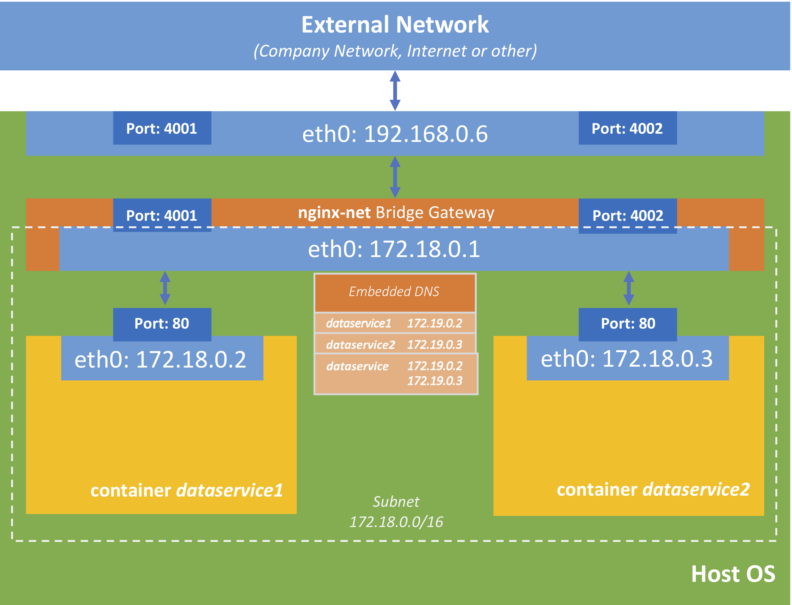
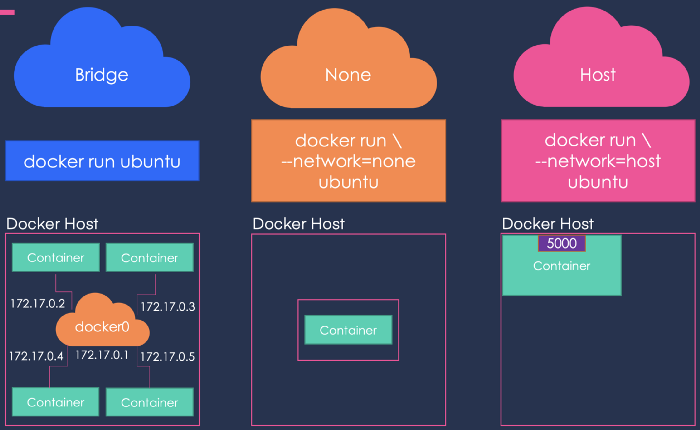
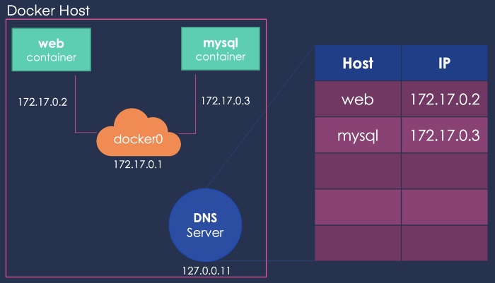
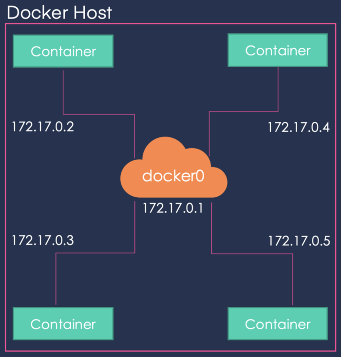
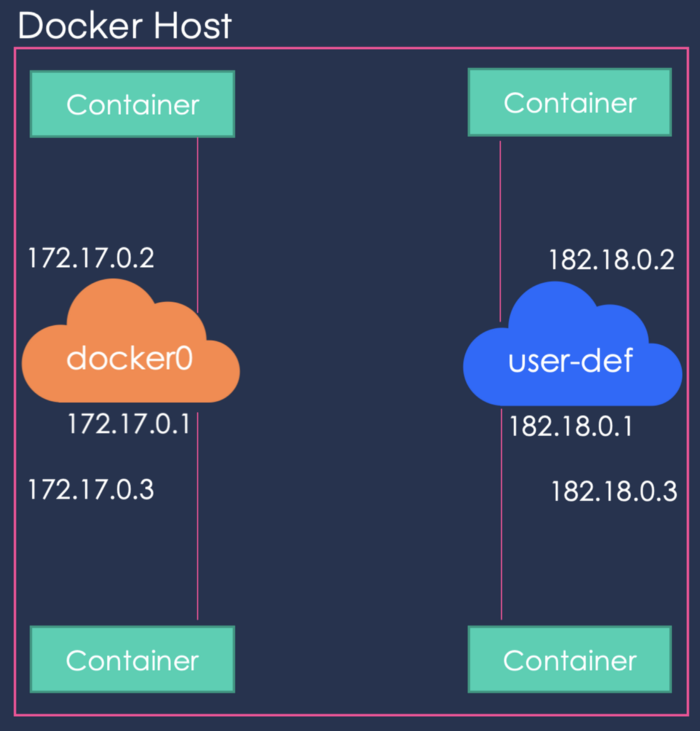

# Using containers
## Networking



### More info
- Bridge and Host are virtual networks Docker creates by default.
- Bridge network is in the default range of **172.17.x.x**
- If you don't specify any network when creating a container, it will run on the bridge network


### Docker also has an internal DNS
#### That's how we are able to reference containers one from another easier

### Containers inside the default bridge network

### Creating our own network
```
docker network create \
--subnet 182.18.0.0/16 \
my-network
```


#### Useful commands and bits of commands:
`docker network ls`\
`docker network create`\
`docker network inspect`\
`docker container run -d --name nginx_2 --network my-network nginx`\
Test connectivity by installing ping inside container and run against another running container from the same network:\
`apt-get update`\
`apt-get install iputils-ping`

<hr>

**10 minute break**

<hr>

🌌 **[Let's continue our journey through the galaxy to our next stop: container images](../2-container-images/class-1.md)**