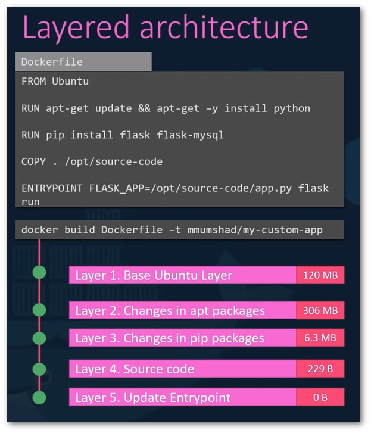
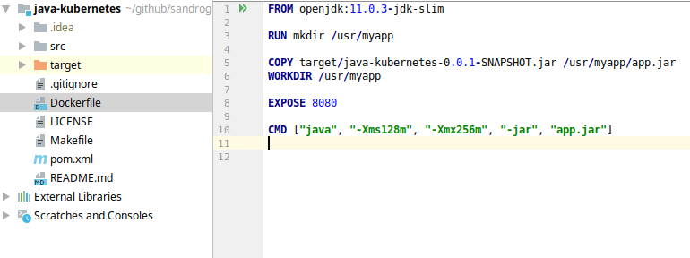
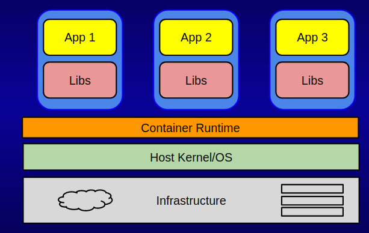

# Container images
## We will learn about:
- What is an image?
- What is inside an image?
- How to use Docker Hub image registry
- Managing our local image cache
- Building our own images

### What is inside an image?

### Java example:

### What is NOT inside an image?
#### No operating system. No kernel.

### How to use Docker Hub image registry
- Let's go to [https://hub.docker.com](https://hub.docker.com) and explore
- Let's `docker image ls` and see what images we used
- Now let's pull different types of images with tags from the hub
### Managing our local image cache
#### Useful commands and bits of commands:
`docker image rm <name>`\
`docker image prune <name>`\
`docker image tag <name>`\
`docker image push <name>`\
`docker image pull <name>`\
`docker login`\
`docker logout`
### Building our own images
`docker image build -t <tag> .`\
Now let's change something in the Dockerfile and see what happens when we run the build command again

### Go back to the quiz in the browser

🌌 **[Quick! Darth Maul hyperdrived in our galaxy. If you're ready, go face him. Good luck little padawan.](homework/README.md)**
