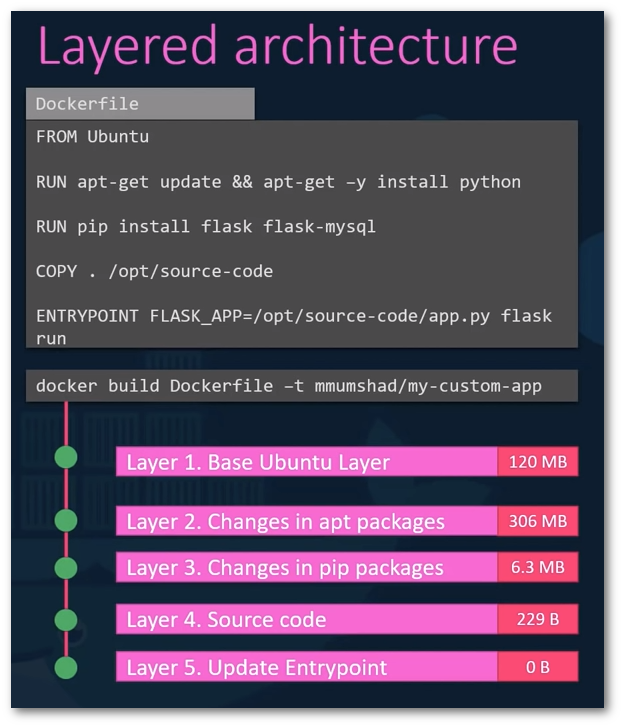
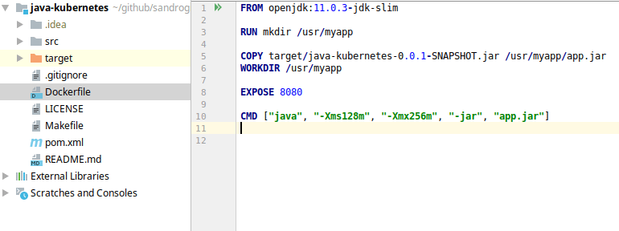
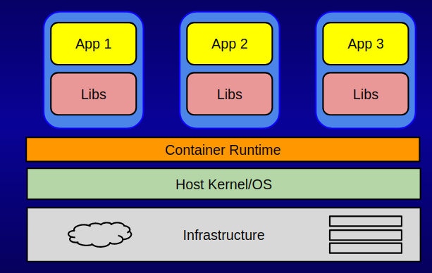
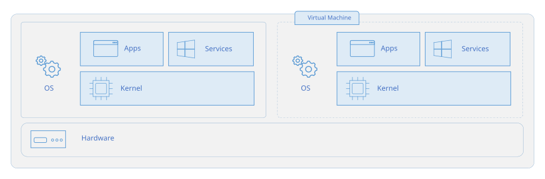
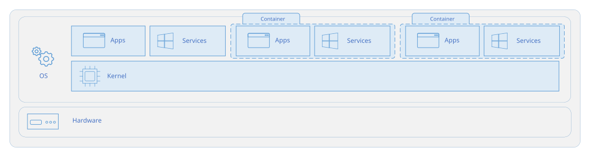

# Container images
## We will learn about:
- What is an image?
- What is inside an image
- ?
- How to use Docker Hub image registry
- Managing our local image cache
- Building our own images

### What is inside an image?

### Java example:

### What is NOT inside an image?
#### No operating system. No kernel.

### Virtual Machine Architecture

### Container Architecture

https://learn.microsoft.com/en-us/virtualization/windowscontainers/about/containers-vs-vm

### How to use Docker Hub image registry
- Let's go to [https://hub.docker.com](https://hub.docker.com) and explore
- Let's `docker image ps` and see what images we used
- Now let's pull different types of images with tags from the hub
### Managing our local image cache
#### Useful commands and bits of commands:
`docker image rm <name>`\
`docker image prune <name>`\
`docker image tag <name>`\
`docker image push <name>`\
`docker image pull <name>`\
`docker login`\
`docker logout`
### Building our own image

**Check all Dockerfile commands: https://docs.docker.com/reference/dockerfile/**

**Let's use [this Dockerfile](dockerfile-lab/Dockerfile) to build our own nginx from scratch**

**After `cd` into `2-container-images/dockerfile-lab` directory, run the below command and assign a tag**\
`docker image build -t my-nginx:1.0 .`

**After you're done, check to see if the image is created:**\
`docker image ls`

**If it's created, let's run it:**\
`docker container run -d -p 8081:80 my-nginx:1.0`

**Let's create a 2.0 version of the docker image which displays 'Version - 2.0' in the index.html file (Don't forget to edit the file before building the image)**\
`docker image build -t my-nginx:2.0 .`

**Now let's upload the container to our own repository in docker hub.**\
First, we have to prefix our image name with our username in docker hub:\
`docker image tag my-nginx MY-USERNAME/my-nginx:2.0`

**Send it!**\
`docker image push MY-USERNAME/my-nginx:latest`

🌌 **10min break**

🌌 **[Lab time](homework/README.md)**
