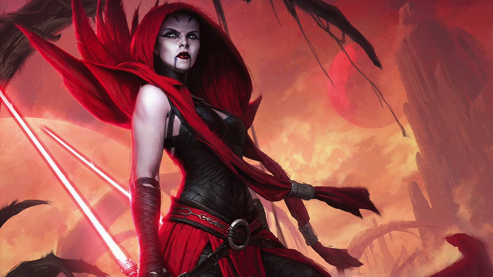

# Ventress challange

## Fight Ventress back with Docker force
### R2D2 internal database has a bug! That's how Ventress entered our headquarters.
#### Thankfully Yoda wrote a bugfix and pushed it to our image registry. Let's fix R2D2 and fight back the invaders!
Task name: Database upgrade with containers
Task instructions:
- create a `postgres` container with a named volume `r2d2-data` using version `13.7`
- use Docker Hub to see what the `VOLUME` path is in the Dockerfile and the versions to run it
- check the logs to see if the database starts correctly, then stop the container
- create a new `postgres` container using version `13.8` with the same `r2d2-data` volume
- check logs to validate everything started up correctly

🌌 **[They seem to be retreating! Let's push!](class-2.md)**