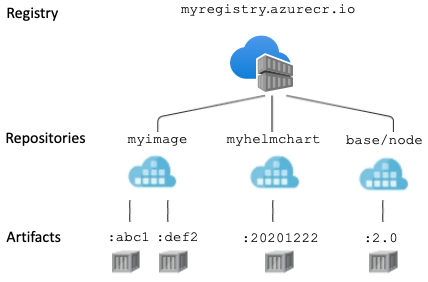
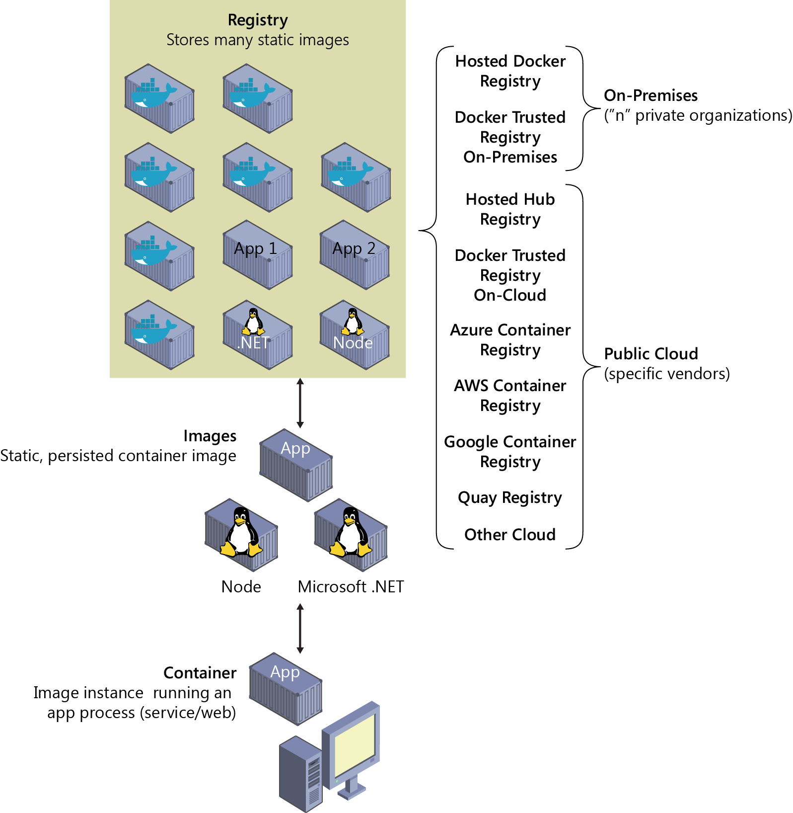

# Container registries


### Let's remember how container images look on registries


### What else is there besides docker hub?
#### PS: ING uses [Azure Container Registry (ACR)](https://azure.microsoft.com/en-us/products/container-registry/#overview) for its docker images

#### Let's check the [azure portal](https://portal.azure.com/#home) and download something
We will have to login before downloading the image with the az tool

```
docker image pull nginx
az account set --subscription 'de6f8bbb-b69a-4182-8527-1e7d4d8f5d93'
az acr login -n p17680
docker image tag nginx p17680.azurecr.io/nginx
docker image push p17680.azurecr.io/nginx
```

<hr>

## Let's build our own image registry using docker hub!
`curl -X GET http://localhost:5000/v2/_catalog`

<hr>

### Come back for the quiz after you finish with everything

<hr>

🌌 [We took over the Docker galaxy. What now?](class-2.md)