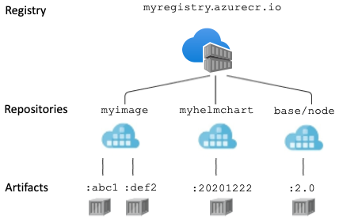
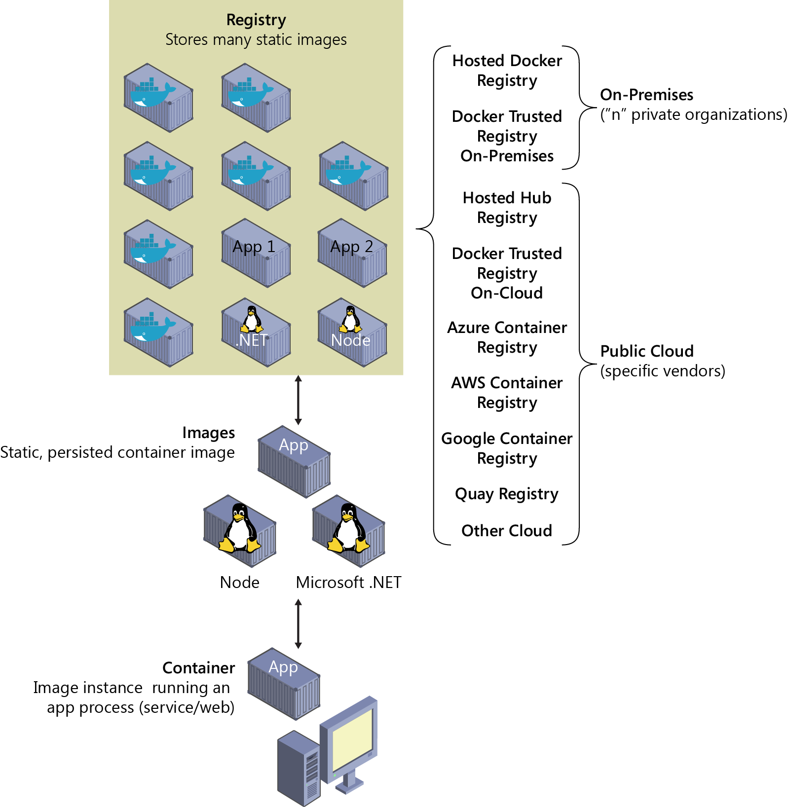

# Container registries

### Let's remember how container images look on registries

### What else is there besides docker hub?
#### PS: ING uses [Azure Container Registry (ACR)](https://azure.microsoft.com/en-us/products/container-registry/#overview) for its docker images

## Let's build our own image registry using docker hub!
Run local registry `docker run -d -p 5000:5000 --name my-registry registry:2`

Display repository stored images
`curl -X GET http://localhost:5000/v2/_catalog`

Lets push a image (for e.g. todo)
1. Tag your image with the local registry address
2. Push the image in the local registry
3. Remove the image from your local machine
4. Pull the image from your local registry
5. Check with the above curl that the local container registry contains your image

### Go to the [quiz](https://kahoot.it/)
### The END

