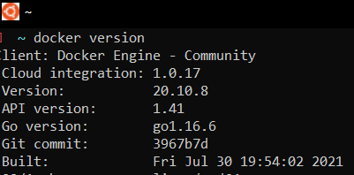

## Prerequisites
- Register an account on [https://hub.docker.com](https://hub.docker.com)
- Docker Desktop
- Git
### Check everything is working

Go to your terminal and write `docker version`

If everything is working fine you should be seeing something like below:

Congrats!

🌌 **[Let's start](0-introduction/class-1.md) on our journey conquering the docker galaxy**
