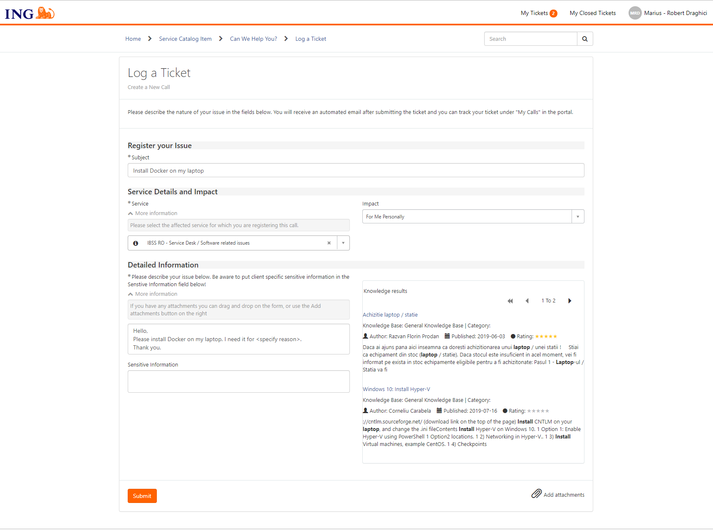

## Prerequisites
- Register an account on [https://hub.docker.com](https://hub.docker.com)
- Docker Desktop
- AZ CLI (optional)
### Windows
If you run windows you will also need to install WSL 2
### To install Docker Desktop and WSL 2 you need to log a ticket on ING Portal
- Go to [ServiceNow (ING Portal)](https://ing.service-now.com/ing_portal)
- Click on 'Get Help'
- Example of request:

### Check everything is working

Go to your terminal and write `docker version`

If everything is working fine you should be seeing something like below:

Congrats!

🌌 **[Let's start](0-introduction/class-1.md) on our journey conquering the docker galaxy**
